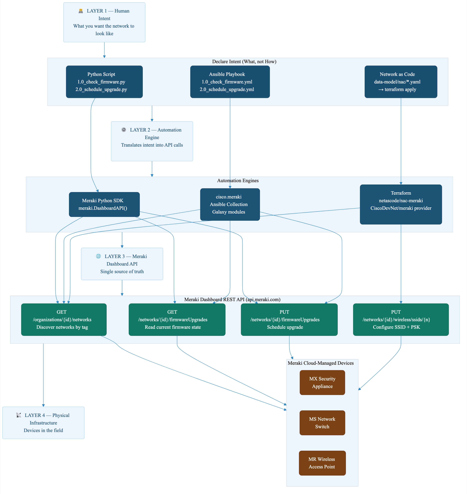
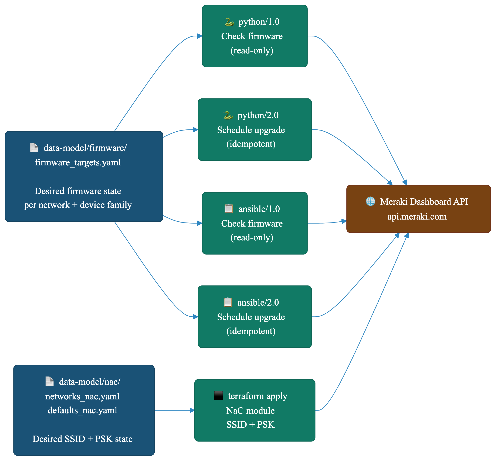

# Network Automation with Cisco Meraki
### A Practical Guide to Infrastructure as Code for Network Engineers

---

## Table of Contents

1. [What Is Infrastructure as Code?](#1-what-is-infrastructure-as-code)
2. [The Abstraction Model — How IaC Hides Complexity](#2-the-abstraction-model--how-iac-hides-complexity)
3. [Three Approaches, One Goal](#3-three-approaches-one-goal)
4. [Use Cases Demonstrated in This Repository](#4-use-cases-demonstrated-in-this-repository)
5. [Repository Structure](#5-repository-structure)
6. [Getting Started](#6-getting-started)
7. [Approach 1 — Python Scripting](#7-approach-1--python-scripting)
8. [Approach 2 — Ansible Playbooks](#8-approach-2--ansible-playbooks)
9. [Approach 3 — Network as Code with Terraform](#9-approach-3--network-as-code-with-terraform)
10. [The Shared Data Model](#10-the-shared-data-model)
11. [CI/CD — Automated Deployments with GitHub Actions](#11-cicd--automated-deployments-with-github-actions)
12. [Credentials and Secrets Management](#12-credentials-and-secrets-management)
13. [Troubleshooting](#13-troubleshooting)

---

## 1. What Is Infrastructure as Code?

### 1.1 The Problem with Manual Configuration

Imagine you are a network engineer responsible for 50 branch offices, each with a Cisco Meraki security appliance, a stack of switches, and a wireless access point. Every week there are routine tasks: updating firmware, rotating Wi-Fi passwords, adjusting security policies. Done manually — logging into each dashboard, clicking through menus, verifying the change — this work is:

- **Slow.** An experienced engineer might configure 10 devices per hour.
- **Error-prone.** One missed checkbox, one typo in a VLAN ID, and you have an incident.
- **Undocumented.** What was the network configured to before you changed it? Who changed it? Why?
- **Unscalable.** 50 sites today, 500 sites tomorrow — the work scales linearly with headcount.

Infrastructure as Code (IaC) solves all of these problems.

### 1.2 The Core Idea

> **Infrastructure as Code is the practice of defining and managing your network (or system) configuration in plain text files, and using software tools to apply those files to your infrastructure automatically.**

Instead of clicking through a dashboard, you write a file that says:

```yaml
network: Branch-Office-01
firmware:
  wireless_version_id: "15763"   # MR 32.1.7 stable
  upgrade_datetime: "2026-07-01T02:00:00Z"
```

Then you run a command — `ansible-playbook`, `python script.py`, or `terraform apply` — and the tool reads that file, talks to the Meraki Dashboard API, and makes the configuration match exactly what you declared. No clicking. No manual steps. No forgetting.

### 1.3 Why IaC Matters

| Traditional "ClickOps" | Infrastructure as Code |
|---|---|
| Changes are invisible — no record of what changed or when | Every change is a Git commit — full history, author, timestamp, and reason |
| Documentation is a separate, always-out-of-date Word document | The configuration **is** the documentation |
| Reproducing a configuration on a new device requires tribal knowledge | Re-run the playbook or `terraform apply` on any device |
| Testing means hoping you did not break anything | You can run `--check` (dry run) to preview changes before applying them |
| One engineer can manage ~50 devices | One engineer with automation can manage 5,000 devices |
| A mistake is hard to reverse | A rollback is `git revert` followed by re-applying |

### 1.4 Where IaC Is Most Beneficial

IaC delivers the most value in environments that share some of these characteristics:

- **Scale** — more than a handful of devices or networks to manage
- **Repetition** — the same configuration pattern applied across many sites
- **Compliance requirements** — auditors need proof that configurations match a documented standard
- **High rate of change** — frequent firmware updates, regular password rotations, dynamic policy changes
- **Team environments** — multiple people making changes to the same infrastructure
- **Disaster recovery** — the ability to rebuild a configuration from scratch quickly

Even in small environments (5–10 devices), adopting IaC early builds habits and skills that pay dividends as the network grows.

---

## 2. The Abstraction Model — How IaC Hides Complexity

### 2.1 Layers of Abstraction

One of the most powerful concepts in software engineering — and increasingly in network engineering — is **abstraction**: the idea that you should only have to think about *what* you want, not *how* to achieve it.

When you drive a car, you turn the steering wheel — you do not think about the hydraulic fluid pressure in the power steering rack. The steering wheel is an abstraction over a complex mechanical system. IaC works the same way.

The diagram below shows the four layers of abstraction in this repository:



> Diagram source: [`images/iac-abstraction.mmd`](images/iac-abstraction.mmd)

**Layer 1 — Human Intent.** You write a YAML file, a Python script, or an Ansible playbook that expresses *what* you want in plain, readable language. You do not need to know anything about HTTP headers, JSON payloads, or API rate limits.

**Layer 2 — Automation Engine.** A tool (Python SDK, Ansible collection, or Terraform provider) reads your intent and translates it into the correct API calls. It handles authentication, pagination, error retries, and idempotency — meaning it only makes a change if a change is actually needed.

**Layer 3 — Meraki Dashboard API.** The Meraki REST API is the authoritative interface to your Meraki organization. Every operation — reading network state, scheduling firmware upgrades, configuring SSIDs — happens through this API. The automation engines call it on your behalf.

**Layer 4 — Physical Infrastructure.** Your actual Meraki devices (MX appliances, MS switches, MR access points) receive configuration changes pushed by the Meraki Dashboard cloud. You never connect directly to the devices.

### 2.2 What Abstraction Gives You

The practical benefit of this layered model is that you — the network engineer — work entirely at Layer 1. You never need to:

- Write an HTTP `PUT` request by hand
- Remember that firmware upgrades use a different endpoint format than SSID configuration
- Handle API pagination when an organization has more than 1,000 networks
- Worry about whether to use `GET` before `PUT` to check current state

The automation engine handles all of that. Your job is to declare intent clearly.

### 2.3 Consistency Through Abstraction

When multiple engineers use the same tool to apply the same data model, configuration drift becomes impossible. There is no way for one engineer to configure Site A differently from Site B if both sites are defined in the same YAML file and applied with the same playbook. The abstraction enforces consistency as a side effect.

---

## 3. Three Approaches, One Goal

This repository demonstrates three distinct IaC approaches for Meraki network management. Each one sits at a different point on the spectrum from **flexibility** to **declarative intent**:

```
 FLEXIBLE ◄────────────────────────────────────────► DECLARATIVE
   │                        │                               │
Python SDK            Ansible Playbooks           Network as Code
                                                    (Terraform)
 "I write the          "I describe the              "I declare the
  logic"                steps"                       desired state"
```

### Approach 1 — Python Scripting

Python gives you a full programming language. You write loops, conditionals, data transformations, and error handling exactly the way you want. The [Meraki Python SDK](https://github.com/meraki/dashboard-api-python) wraps the REST API in simple Python function calls.

**Best for:** Custom logic, one-off data collection, complex multi-step workflows that do not fit neatly into a tool's model.

### Approach 2 — Ansible Playbooks

Ansible is a task automation tool built around the concept of *playbooks* — ordered lists of tasks expressed in YAML. Each task calls a *module* (a pre-built piece of logic) that knows how to talk to a specific system. The `cisco.meraki` Ansible Galaxy collection provides modules for the Meraki Dashboard API.

**Best for:** Multi-step workflows that must run in order, teams already using Ansible for server or network automation, situations where you want human-readable automation that non-developers can review.

### Approach 3 — Network as Code with Terraform

Terraform is a declarative tool: you describe the *desired final state* of your network in a data model (YAML files), and Terraform figures out what API calls are needed to reach that state. The [netascode/nac-meraki](https://registry.terraform.io/modules/netascode/nac-meraki/meraki) Terraform module reads your YAML and translates it into Meraki API operations.

**Best for:** Long-lived configuration that must always match a declared state, SSID management, policy enforcement, teams familiar with Terraform from cloud infrastructure management.

---

## 4. Use Cases Demonstrated in This Repository

| # | Use Case | Approach | Files |
|---|---|---|---|
| 1 | **Discover available firmware versions** across networks by tag | Python, Ansible | `python/1.0_*`, `ansible/1.0_*` |
| 2 | **Schedule firmware upgrades** across networks by tag, only where current ≠ target | Python, Ansible | `python/2.0_*`, `ansible/2.0_*` |
| 3 | **Manage SSID configuration** (name, PSK, encryption, visibility) declaratively | Network as Code | `network-as-code/`, `data-model/nac/` |
| 4 | **PSK rotation** without storing secrets in files using environment variable injection | Network as Code | `network-as-code/networks_nac.yaml`, `!env` tags |
| 5 | **Shared data model** that serves both firmware tools (Ansible + Python) from a single YAML file | Python, Ansible | `data-model/firmware/firmware_targets.yaml` |
| 6 | **CI/CD automation** — auto-apply Terraform when the data model changes, using a self-hosted runner | GitHub Actions | `.github/workflows/nac-apply.yml` |
| 7 | **Network tag–based targeting** — operate on any number of networks without listing individual IDs | Python, Ansible | All scripts |

---

## 5. Repository Structure

```
ansible-meraki-firmware-upgrade/
│
├── README.md                           ← You are here
│
├── data-model/                         ← Shared YAML configuration (the source of truth)
│   ├── firmware/
│   │   └── firmware_targets.yaml       ← Target firmware versions per network (Ansible + Python)
│   └── nac/
│       ├── networks_nac.yaml           ← SSID + PSK declarations (Terraform NaC only)
│       └── defaults_nac.yaml           ← Org-wide SSID defaults merged by NaC module
│
├── python/                             ← Python scripting approach
│   ├── 1.0_check_available_firmware_by_tag.py   ← Read-only: discover firmware versions
│   ├── 2.0_schedule_firmware_upgrade_by_tag.py  ← Schedule firmware upgrades
│   └── requirements.txt               ← pip dependencies (meraki, PyYAML)
│
├── ansible/                            ← Ansible playbook approach
│   ├── 1.0_check_available_firmware_by_tag.yml  ← Read-only: discover firmware versions
│   ├── 2.0_schedule_firmware_upgrade_by_tag.yml ← Schedule firmware upgrades
│   ├── README.md                       ← Detailed Ansible reference documentation
│   ├── collections/
│   │   └── requirements.yml           ← cisco.meraki Galaxy collection dependency
│   ├── inventory/
│   │   └── meraki.yml                 ← Ansible inventory (localhost only)
│   └── group_vars/all/
│       ├── vars.yml                   ← Non-sensitive shared variables
│       └── vault.yml                  ← API key (Ansible Vault encrypted)
│
├── network-as-code/                    ← Terraform Network as Code approach
│   ├── terraform.tf                   ← Provider configuration (CiscoDevNet/meraki ~> 1.12)
│   ├── main.tf                        ← NaC module declaration with methodology comments
│   ├── vault-envconsul.sh             ← CI/CD wrapper: pull PSKs from HashiCorp Vault
│   ├── .envrc.example                 ← Template for local environment variables
│   └── .gitignore                     ← Excludes .terraform/, state files, .envrc
│
├── .github/
│   └── workflows/
│       └── nac-apply.yml              ← GitHub Actions: auto terraform apply on data model push
│
├── images/                             ← Diagrams referenced in this README
│   ├── iac-abstraction.png            ← IaC abstraction layer diagram
│   ├── iac-abstraction.mmd            ← Diagram source (Mermaid)
│   ├── repo-workflow.png              ← Data flow diagram
│   └── repo-workflow.mmd              ← Diagram source (Mermaid)
│
├── diagrams/                           ← Draw.io architecture diagrams
│   ├── 1.0-meraki-admin-logical-flow.drawio
│   ├── 2.0-pb1-module-mapping.drawio
│   └── 3.0-pb2-module-mapping.drawio
│
├── cisco-workflows/                    ← Reference Meraki workflow templates
│   ├── Appliance - Available Firmware.txt
│   └── Schedule Firmware Upgrade for Networks by Tag.json
│
├── ansible.cfg                         ← Ansible configuration (inventory path, settings)
├── .envrc                             ← direnv environment variables (gitignored)
└── .gitignore                         ← Root gitignore
```

---

## 6. Getting Started

This section walks you through everything you need to set up your environment and run your first command. Take it one step at a time.

### 6.1 Prerequisites

Before you begin, make sure the following are installed and available in your terminal.

#### Required for all approaches

| Tool | Minimum Version | How to Check | Install Guide |
|---|---|---|---|
| Git | 2.x | `git --version` | [git-scm.com](https://git-scm.com/downloads) |
| Python | 3.9 | `python3 --version` | [python.org](https://www.python.org/downloads/) |
| A Meraki API key | — | Meraki Dashboard → Profile → API access | [Meraki docs](https://developer.cisco.com/meraki/api-v1/authorization/) |

#### Required for Python approach

| Tool | How to Install |
|---|---|
| `meraki` Python SDK | `pip3 install meraki` |
| `PyYAML` | `pip3 install PyYAML` |

#### Required for Ansible approach

| Tool | Minimum Version | How to Install |
|---|---|---|
| Ansible Core | 2.15 | `pip3 install ansible` |
| cisco.meraki collection | 2.18.0 | `ansible-galaxy collection install -r ansible/collections/requirements.yml` |

#### Required for Network as Code approach

| Tool | Minimum Version | How to Check | Install Guide |
|---|---|---|---|
| Terraform | 1.8.0 | `terraform version` | [developer.hashicorp.com](https://developer.hashicorp.com/terraform/install) |
| direnv *(recommended)* | any | `direnv version` | `brew install direnv` |

### 6.2 Step 1 — Clone the Repository

```bash
git clone https://github.com/imanassypov/ansible-meraki-firmware-upgrade.git
cd ansible-meraki-firmware-upgrade
```

### 6.3 Step 2 — Get Your Meraki API Key

Log into the [Meraki Dashboard](https://dashboard.meraki.com). Click your username in the top-right corner → **My profile** → scroll down to **API access** → **Generate new API key**.

Copy the key somewhere safe. You will only see it once.

> **Security note:** Treat your API key like a password. It grants full read/write access to your Meraki organization. Never paste it into a command directly in a shared terminal, never commit it to Git.

### 6.4 Step 3 — Set Your API Key as an Environment Variable

The safest way to provide your API key to all three tools in this repository is via an environment variable. All tools — the Python SDK, the Ansible `cisco.meraki` collection, and the Terraform `CiscoDevNet/meraki` provider — read this same variable automatically.

```bash
export MERAKI_API_KEY="your-api-key-here"
```

If you want this to persist across terminal sessions, add the `export` line to your shell profile (`~/.zshrc`, `~/.bash_profile`), or use **direnv** (recommended — see [Section 12](#12-credentials-and-secrets-management)).

### 6.5 Step 4 — Verify Meraki API Access

Run a quick check with Python to confirm the key works:

```bash
python3 -c "
import meraki, os
dashboard = meraki.DashboardAPI(os.environ['MERAKI_API_KEY'], suppress_logging=True)
orgs = dashboard.organizations.getOrganizations()
print('Connected! Organizations visible to this key:')
for o in orgs:
    print(f'  {o[\"name\"]} (ID: {o[\"id\"]})')
"
```

Expected output:

```
Connected! Organizations visible to this key:
  Igor M (ID: 443964)
```

If you see `AuthorizationError`, double-check that the API key was copied correctly and that API access is enabled in the Meraki Dashboard.

### 6.6 Step 5 — Tag Your Networks

Both the Python scripts and Ansible playbooks use **network tags** to find which networks to operate on. Tags are set in the Meraki Dashboard:

1. Log into [dashboard.meraki.com](https://dashboard.meraki.com)
2. Select your organization
3. Go to **Network-wide → General** for each network
4. Under **Tags**, add a tag (e.g., `Cisco-Lab`, `branch`, `production`)

Tags are case-sensitive. The scripts will only operate on networks that carry a tag you specify.

### 6.7 What to Do Next

Choose the approach that matches your background and the task you want to accomplish:

| If you want to… | Start with… |
|---|---|
| Check what firmware versions are available | [Section 7 (Python)](#7-approach-1--python-scripting) or [Section 8 (Ansible)](#8-approach-2--ansible-playbooks) |
| Schedule firmware upgrades automatically | [Section 7.2](#72-script-20--schedule-firmware-upgrades) or [Section 8.2](#82-playbook-20--schedule-firmware-upgrades) |
| Manage SSID configuration as code | [Section 9 (Terraform NaC)](#9-approach-3--network-as-code-with-terraform) |
| Understand how the data model works | [Section 10](#10-the-shared-data-model) |
| Set up CI/CD automation | [Section 11](#11-cicd--automated-deployments-with-github-actions) |

---

## 7. Approach 1 — Python Scripting

### 7.1 What Python Gives You

Python is the Swiss Army knife of network automation. The [Meraki Python SDK](https://github.com/meraki/dashboard-api-python) (`pip install meraki`) wraps the entire Meraki Dashboard REST API in simple Python objects. Instead of constructing HTTP requests by hand, you call methods:

```python
import meraki, os

dashboard = meraki.DashboardAPI(os.environ['MERAKI_API_KEY'])

# List all networks in an organization
networks = dashboard.organizations.getOrganizationNetworks(organizationId="443964")

# Get firmware information for a specific network
firmware = dashboard.networks.getNetworkFirmwareUpgrades(networkId="L_650207196201616147")
```

The SDK handles:
- Authentication (injects the API key header on every request)
- Pagination (fetches all pages of results automatically)
- Rate limiting (respects Meraki's API rate limits, retries when throttled)
- Error handling (raises Python exceptions with descriptive messages)

### 7.2 Installing Python Dependencies

```bash
pip3 install -r python/requirements.txt
```

The `requirements.txt` file specifies:

```
meraki       # Meraki Dashboard API Python library
PyYAML       # YAML file parsing (for reading data-model/ files)
```

### 7.3 Script 1.0 — Check Available Firmware

**File:** `python/1.0_check_available_firmware_by_tag.py`
**Purpose:** Read-only. Discovers all networks matching your tags and prints current and available firmware versions for each device type (MX appliance, MS switch, MR access point).

#### How it works

The script follows this logic:

```
1. Read tags from data-model/firmware/firmware_targets.yaml
   (or from --tags argument, or MERAKI_NETWORK_TAGS env var)
2. Authenticate with the Meraki SDK
3. List all organizations visible to the API key
4. For each org: list all networks
5. Filter: keep only networks whose tags overlap with your target tags
6. For each matching network: query /networks/{id}/firmwareUpgrades
7. Print a formatted summary showing:
   - Current firmware version and ID for each device type
   - All available versions with their IDs and release types
```

The **version IDs** in the output are what you copy into `data-model/firmware/firmware_targets.yaml` when you want to schedule an upgrade.

#### Running it

```bash
# Auto-read tags from data-model/firmware/firmware_targets.yaml (recommended)
python python/1.0_check_available_firmware_by_tag.py

# Specify tags explicitly
python python/1.0_check_available_firmware_by_tag.py --tags Cisco-Lab

# Multiple tags
python python/1.0_check_available_firmware_by_tag.py --tags Cisco-Lab FTD
```

#### Sample output

```
══════════════════════════════════════════════════════════════════
Network : Meraki Core
Org     : Igor M
Tags    : Cisco-Lab
──────────────────────────────────────────────────────────────────
APPLIANCE (MX)
  Current   : MX 18.211.5.2 (ID: 4625)
  Available :
    - MX 19.2.8 [stable]      →  ID: 15806
    - MX 19.2.4 [stable]      →  ID: 15506
──────────────────────────────────────────────────────────────────
SWITCH (MS)
  Current   : MS 15.21.1 (ID: 3101)
  Available :
    - MS 17.2.2 [stable]      →  ID: 6016
──────────────────────────────────────────────────────────────────
WIRELESS (MR)
  Current   : MR 30.7.1 (ID: 11440)
  Available :
    - MR 32.1.7 [stable]      →  ID: 15763
    - MR 31.5.2 [stable]      →  ID: 13875
══════════════════════════════════════════════════════════════════
```

From this output, you can see that:
- To upgrade MX to the latest stable, use `appliance_version_id: "15806"`
- To upgrade MS to the latest stable, use `switch_version_id: "6016"`
- To upgrade MR to the latest stable, use `wireless_version_id: "15763"`

### 7.4 Script 2.0 — Schedule Firmware Upgrades

**File:** `python/2.0_schedule_firmware_upgrade_by_tag.py`
**Purpose:** Reads `data-model/firmware/firmware_targets.yaml` and enforces the declared firmware state. For each network, it compares the current version against the target and schedules an upgrade only where they differ.

#### The idempotency guarantee

> **Idempotent** means you can run the same operation multiple times and get the same result — no duplicates, no errors, no unintended side effects.

Script 2.0 is idempotent. If a network is already on the target firmware version, the script skips it and prints `COMPLIANT`. If you run it 10 times, only the first run (when the firmware actually differs) does anything.

#### Running it

```bash
# Normal run — evaluate compliance and schedule upgrades
python python/2.0_schedule_firmware_upgrade_by_tag.py

# Dry run — show the plan without making any API changes
python python/2.0_schedule_firmware_upgrade_by_tag.py --check
```

Always run with `--check` first on a new environment.

#### Sample output (dry run)

```
══════════════════════════════════════════════════════════════════
COMPLIANCE EVALUATION (DRY RUN — no changes will be made)
══════════════════════════════════════════════════════════════════
Network : Meraki Core  |  Org: Igor M
  Appliance : UPGRADE NEEDED   Current: MX 18.211.5.2 (4625) → Target: 15806
  Switch    : UPGRADE NEEDED   Current: MS 15.21.1 (3101)    → Target: 6016
  Wireless  : COMPLIANT        Current: MR 32.1.7 (15763)   — no action needed
──────────────────────────────────────────────────────────────────
Scheduled at : next maintenance window (upgrade_datetime not set)
══════════════════════════════════════════════════════════════════
```

---

## 8. Approach 2 — Ansible Playbooks

### 8.1 What Ansible Gives You

Ansible expresses automation as a **playbook** — a YAML file listing tasks to run in order, each calling a *module*. A module is a self-contained piece of logic that knows how to do one specific thing: create a user, copy a file, call an API endpoint.

The key insight is that Ansible is designed for *humans to read*. A well-written playbook is close to plain English:

```yaml
- name: Get all Meraki organizations
  cisco.meraki.organizations_info:
    meraki_api_key: "{{ meraki_api_key }}"
  register: org_list

- name: Filter networks matching our tags
  ansible.builtin.set_fact:
    target_networks: "{{ all_networks | selectattr('tags', 'intersect', network_tags) }}"
```

Anyone on your team can read this, understand what it does, and propose a change — even without deep Python knowledge.

### 8.2 Installing the Ansible Collection

The `cisco.meraki` collection is distributed through [Ansible Galaxy](https://galaxy.ansible.com). Install it with:

```bash
ansible-galaxy collection install -r ansible/collections/requirements.yml
```

This downloads the `cisco.meraki` collection (version ≥ 2.18.0) and makes its modules available to Ansible. The `requirements.yml` file pins the version so your automation is reproducible.

### 8.3 Playbook 1.0 — Check Available Firmware

**File:** `ansible/1.0_check_available_firmware_by_tag.yml`
**Purpose:** Mirrors `python/1.0_*` exactly — same data, different tool.

#### Running it

```bash
# From the repository root
ansible-playbook ansible/1.0_check_available_firmware_by_tag.yml \
  -i ansible/inventory/meraki.yml \
  -e '{"network_tags": ["Cisco-Lab"]}' \
  --vault-password-file .vault_pass
```

> **Important:** Always use the JSON dict format (`-e '{"network_tags": [...]}'`) for list variables in Ansible. The shorthand `key=value` format passes the value as a string, not a list, and the tag filter will not work correctly.

#### How the playbook communicates with Meraki

Unlike traditional Ansible that SSH into devices, these playbooks connect only to `localhost`. All Meraki API calls happen over HTTPS from your machine to `api.meraki.com`. Ansible is acting as an HTTP client, not a remote executor.

```
Your machine (localhost)
      │
      │  HTTPS port 443
      ▼
api.meraki.com  →  Your Meraki Org → Networks → Devices
```

No SSH keys. No device credentials. No firewall rules needed on the devices themselves.

### 8.4 Playbook 2.0 — Schedule Firmware Upgrades

**File:** `ansible/2.0_schedule_firmware_upgrade_by_tag.yml`
**Purpose:** Mirrors `python/2.0_*`. Reads `data-model/firmware/firmware_targets.yaml`, compares current state to desired state, and schedules upgrades only where needed.

#### Running it

```bash
ansible-playbook ansible/2.0_schedule_firmware_upgrade_by_tag.yml \
  -i ansible/inventory/meraki.yml \
  -e '{"network_tags": ["Cisco-Lab"]}' \
  --vault-password-file .vault_pass
```

#### Dry run with `--check`

```bash
ansible-playbook ansible/2.0_schedule_firmware_upgrade_by_tag.yml \
  -i ansible/inventory/meraki.yml \
  -e '{"network_tags": ["Cisco-Lab"]}' \
  --vault-password-file .vault_pass \
  --check
```

### 8.5 Protecting the API Key with Ansible Vault

Your Meraki API key grants full access to your organization. Never commit it in plain text.

Ansible provides **Ansible Vault** — an encryption feature built into Ansible that encrypts files so they can be safely committed to Git. The key is decrypted in memory at runtime — it never touches the disk unencrypted.

#### Setup (one time)

```bash
# 1. Create a vault password file (strong random password)
echo "$(openssl rand -base64 32)" > .vault_pass
chmod 600 .vault_pass

# 2. Add to gitignore (critical — never commit this file)
echo ".vault_pass" >> .gitignore

# 3. Encrypt the vault file that contains your API key
ansible-vault encrypt ansible/group_vars/all/vault.yml \
  --vault-password-file .vault_pass
```

After encryption, `vault.yml` looks like this (safe to commit):

```
$ANSIBLE_VAULT;1.1;AES256
30333534343937636662323135663063...
```

For a complete Ansible reference, including all playbook variables, idempotency details, and troubleshooting, see the detailed [`ansible/README.md`](ansible/README.md).

---

## 9. Approach 3 — Network as Code with Terraform

### 9.1 What Network as Code Means

If Python scripting is *imperative* ("do step 1, then step 2, then step 3") and Ansible is *procedural* ("run these tasks in order"), then Terraform is *declarative*:

> **You describe the desired final state. Terraform figures out how to get there.**

You do not write code that says "create this SSID, then set the PSK, then set the encryption mode." You write a YAML file that says "I want this SSID to exist with these properties" — and Terraform calls the Meraki API to make that true, whatever the current state happens to be.

### 9.2 How It Works in This Repository

The **[netascode/nac-meraki](https://registry.terraform.io/modules/netascode/nac-meraki/meraki)** Terraform module is the engine. It reads your YAML data model files and translates them into Meraki API calls using the **[CiscoDevNet/meraki](https://registry.terraform.io/providers/CiscoDevNet/meraki/latest)** Terraform provider.

The execution chain:

```
terraform apply
   │
   ├── reads network-as-code/main.tf
   │
   ├── invokes module "netascode/nac-meraki/meraki"
   │    └── scans yaml_directories: ["../data-model/nac"]
   │
   ├── reads data-model/nac/defaults_nac.yaml   ← org-wide defaults
   ├── reads data-model/nac/networks_nac.yaml   ← your SSID declarations
   │
   ├── merges defaults + network config → unified model
   │
   └── calls CiscoDevNet/meraki provider
        └── Meraki Dashboard API
             ├── GET  /organizations/{id}/networks   (look up existing networks)
             └── PUT  /networks/{id}/wireless/ssids/{n}  (configure SSIDs)
```

### 9.3 The Data Model — Declaring Intent

The SSID configuration lives in `data-model/nac/networks_nac.yaml`. This file is the *single source of truth* for SSID state. Here is what it looks like:

```yaml
meraki:
  domains:
    - name: "meraki.local"
      organizations:
        - name: "Igor M"
          managed: false          # Org already exists — do not create
          networks:
            - name: "Meraki Core"
              managed: false      # Network already exists — do not create
              tags: [Cisco-Lab]
              wireless:
                ssids:
                  - name: "Test-WiFi"
                    ssid_number: "0"
                    enabled: true
                    auth_mode: "psk"
                    psk: !env MERAKI_CISCO_LAB_PSK    # ← secret, never stored in file
                    encryption_mode: "wpa"
                    wpa_encryption_mode: "WPA2 only"
                    visible: true
```

Two things worth noting:

**`managed: false`** — This tells the NaC module that the organization and network *already exist* in the Meraki Dashboard. Terraform will look them up (using `data` sources) rather than trying to create them. This is the correct setting for most real-world environments where the org and networks were created manually or by another process.

**`!env MERAKI_CISCO_LAB_PSK`** — The `!env` YAML tag is a NaC module feature. At runtime, the module substitutes this tag with the value of the named environment variable. The PSK is never written to any file, never appears in `terraform plan` output, and never gets committed to Git.

### 9.4 Setting Up and Running Terraform

#### Step 1 — Install dependencies

```bash
cd network-as-code
terraform init
```

`terraform init` downloads the `netascode/nac-meraki` module and the `CiscoDevNet/meraki` provider from the Terraform Registry. This only needs to be done once (or when you upgrade provider versions).

#### Step 2 — Set environment variables

Copy the example file and populate it:

```bash
cp network-as-code/.envrc.example network-as-code/.envrc
```

Edit `.envrc`:

```bash
export MERAKI_API_KEY=your-api-key-here
export MERAKI_CISCO_LAB_PSK=your-wifi-password-here
export MERAKI_FTD_PSK=your-other-wifi-password-here
```

If you use direnv, run `direnv allow` in the `network-as-code/` directory. Variables will be injected automatically whenever you `cd` into that directory.

#### Step 3 — Plan (dry run)

Always plan before applying:

```bash
terraform plan
```

Terraform shows exactly what it will do. You should see something like:

```
  # module.meraki.meraki_wireless_ssid.networks_wireless_ssids["meraki.local/Igor M/Meraki Core/Test-WiFi"] will be updated in-place
  ~ resource "meraki_wireless_ssid" "networks_wireless_ssids" {
      ~ psk      = (sensitive value)
        name     = "Test-WiFi"
        # ...
    }

Plan: 0 to add, 1 to change, 0 to destroy.
```

If the plan shows unexpected deletions or creations, investigate before applying.

#### Step 4 — Apply

```bash
terraform apply
```

Terraform prompts for confirmation. Review the plan summary, type `yes`, and Terraform calls the Meraki API to apply the changes.

### 9.5 PSK Rotation

Rotating a Wi-Fi password is now a one-line operation:

```bash
# Direct (local dev)
export MERAKI_CISCO_LAB_PSK=NewSecurePassword123
terraform apply

# Via HashiCorp Vault (CI/CD)
vault kv put secret/meraki/cisco-lab-ssid psk=NewSecurePassword123
./network-as-code/vault-envconsul.sh terraform apply
```

The PSK change appears in the Meraki Dashboard within seconds of `terraform apply` completing.

### 9.6 Directory Isolation — Why Two Data Model Folders?

You may notice that `data-model/` has two subdirectories:

```
data-model/
├── firmware/     ← Read by Python and Ansible ONLY
│   └── firmware_targets.yaml
└── nac/          ← Read by Terraform ONLY
    ├── networks_nac.yaml
    └── defaults_nac.yaml
```

Both `firmware_targets.yaml` and `networks_nac.yaml` use the same `meraki:` root key in their YAML structure. If Terraform were to read both files, it would merge them into a single configuration tree — with unpredictable results. By placing them in separate directories and configuring Terraform to only scan `data-model/nac/`, the two data models are kept completely isolated. Python and Ansible never see `data-model/nac/`, and Terraform never sees `data-model/firmware/`.

---

## 10. The Shared Data Model

### 10.1 What Is the Data Model?

The data model is the *definition* of what you want your network to look like — written in YAML, stored in `data-model/`, and consumed by your automation tools. It is the bridge between human intent and machine action.



> Diagram source: [`images/repo-workflow.mmd`](images/repo-workflow.mmd)

Think of the data model as a configuration contract: "Networks tagged `Cisco-Lab` should be running MR firmware version `15763`, with SSID `Test-WiFi` on slot 0, using WPA2 with the PSK in `MERAKI_CISCO_LAB_PSK`." Any tool that reads the contract and talks to the Meraki API will produce the same outcome.

### 10.2 Firmware Data Model — `data-model/firmware/firmware_targets.yaml`

This file defines the desired firmware end state for each network. Python scripts and Ansible playbooks read it.

```yaml
meraki:
  domains:
    - organizations:
        - name: "Igor M"
          networks:
            - name: "Meraki Core"
              tags: [Cisco-Lab]
              firmware:
                description: "Cisco-Lab — all device families stable firmware"
                upgrade_datetime: ""           # "" = next maintenance window
                upgrade_strategy: "minimizeClientDowntime"
                target:
                  appliance_version_id: "15806"  # MX 19.2.8 stable
                  switch_version_id: "6016"       # MS 17.2.2 stable
                  wireless_version_id: "15763"    # MR 32.1.7 stable
```

#### Schema reference

| Field | Required | Description |
|---|---|---|
| `name` | Yes | Exact network name (case-sensitive) as shown in the Meraki Dashboard |
| `tags` | Yes | Network tags — used for informational grouping in the data model |
| `firmware.description` | No | Human-readable label shown in script output |
| `firmware.upgrade_datetime` | No | ISO 8601 UTC timestamp. Empty string = next maintenance window |
| `firmware.upgrade_strategy` | No | `minimizeClientDowntime` (default) or `minimizeUpgradeTime` |
| `firmware.target.appliance_version_id` | No | MX target version ID. Empty string = do not touch |
| `firmware.target.switch_version_id` | No | MS target version ID. Empty string = do not touch |
| `firmware.target.wireless_version_id` | No | MR target version ID. Empty string = do not touch |

Version IDs come from running `python/1.0_*` or `ansible/1.0_*`. They are stable numeric strings that Meraki uses internally to identify specific firmware builds.

### 10.3 NaC Data Model — `data-model/nac/networks_nac.yaml`

This file defines the desired SSID and wireless configuration. Terraform reads it exclusively.

See [Section 9.3](#93-the-data-model--declaring-intent) for a full explanation.

---

## 11. CI/CD — Automated Deployments with GitHub Actions

### 11.1 The Problem CI/CD Solves

When you run `terraform apply` locally, the SSID change happens immediately. But what if you want changes to happen automatically whenever a team member edits the data model and pushes to Git? That is what CI/CD (Continuous Integration / Continuous Deployment) provides.

### 11.2 How It Works in This Repository

The workflow file `.github/workflows/nac-apply.yml` defines a GitHub Actions pipeline that:

1. Triggers whenever a file in `data-model/nac/` is pushed to the `main` branch
2. Runs on a **self-hosted runner** — your laptop or a dedicated machine — so it has access to local Terraform state and does not need secrets stored in GitHub
3. Executes: `terraform init` → `terraform plan` → `terraform apply`

```yaml
on:
  workflow_dispatch: {}         # Manual trigger from GitHub UI
  push:
    branches: [main]
    paths: ["data-model/nac/**"]    # Only triggers on NaC data model changes

jobs:
  terraform-apply:
    runs-on: self-hosted
    defaults:
      run:
        working-directory: network-as-code
    steps:
      - uses: actions/checkout@v4
      - run: terraform init -input=false
      - run: terraform plan -input=false -out=tfplan
      - run: terraform apply -input=false tfplan
```

### 11.3 Setting Up the Self-Hosted Runner

A self-hosted runner is a background process on your machine that listens for jobs from GitHub and executes them locally.

#### Install the runner

1. Go to your repository on GitHub → **Settings** → **Actions** → **Runners** → **New self-hosted runner**
2. Follow the instructions to download and configure the runner
3. Set required environment variables in `~/actions-runner/.env`:

```bash
MERAKI_API_KEY=your-api-key-here
MERAKI_CISCO_LAB_PSK=your-psk-here
MERAKI_FTD_PSK=your-other-psk-here
PATH=/opt/homebrew/bin:/usr/local/bin:/usr/bin:/bin:/usr/sbin:/sbin
```

> **Note:** The `PATH` entry is required because the runner's shell does not inherit your interactive shell's `PATH`. Without it, `terraform` will not be found even if it is installed.

#### Start the runner

```bash
cd ~/actions-runner
./run.sh
```

You should see:

```
√ Connected to GitHub
Listening for Jobs
```

#### Make it persistent (macOS)

To survive reboots without manual intervention, install the runner as a launchd service:

```bash
cd ~/actions-runner
./svc.sh install
./svc.sh start
```

### 11.4 Triggering the Pipeline

The pipeline triggers automatically on any push to `main` that changes a file under `data-model/nac/`. It can also be triggered manually from the GitHub UI:

**GitHub repository → Actions → NaC — Terraform apply → Run workflow**

---

## 12. Credentials and Secrets Management

### 12.1 The Golden Rule

> **Never commit credentials to Git.** Not in YAML files, not in comments, not in example files. Not even "just for testing."

This repository is designed so that all credentials — the Meraki API key and Wi-Fi PSKs — are provided exclusively through environment variables. No credential ever touches a file that could be committed.

### 12.2 Local Development — direnv

[direnv](https://direnv.net) is a shell extension that automatically loads and unloads environment variables when you change directories. It reads from a `.envrc` file in each directory.

```bash
# Install (macOS)
brew install direnv

# Add to your shell profile (~/.zshrc or ~/.bash_profile)
eval "$(direnv hook zsh)"   # for zsh
eval "$(direnv hook bash)"  # for bash
```

Then create `.envrc` at the repository root:

```bash
# .envrc (this file is gitignored)
export MERAKI_API_KEY=your-api-key-here
export MERAKI_NETWORK_TAGS=Cisco-Lab,FTD
```

And in `network-as-code/.envrc`:

```bash
# network-as-code/.envrc (also gitignored)
export MERAKI_API_KEY=your-api-key-here
export MERAKI_CISCO_LAB_PSK=your-psk-here
export MERAKI_FTD_PSK=your-other-psk-here
```

Allow direnv to load each file once:

```bash
direnv allow .
direnv allow network-as-code/
```

After that, variables are injected automatically whenever you `cd` into the directory.

### 12.3 CI/CD — Runner Environment File

The self-hosted GitHub Actions runner reads environment variables from `~/actions-runner/.env`. This file lives on your machine only — never in the Git repository.

```bash
# ~/actions-runner/.env
MERAKI_API_KEY=your-api-key-here
MERAKI_CISCO_LAB_PSK=your-psk-here
MERAKI_FTD_PSK=your-other-psk-here
PATH=/opt/homebrew/bin:/usr/local/bin:/usr/bin:/bin:/usr/sbin:/sbin
```

### 12.4 CI/CD — HashiCorp Vault (Advanced)

For team environments where the API key and PSKs are shared among multiple engineers, [HashiCorp Vault](https://www.vaultproject.io) is the recommended secret store. The `network-as-code/vault-envconsul.sh` script wraps any Terraform command to pull PSK values from Vault at runtime using [envconsul](https://github.com/hashicorp/envconsul):

```bash
# Store PSK in Vault
vault kv put secret/meraki/cisco-lab-ssid psk=NewSecurePassword

# Apply with PSK injected from Vault
export VAULT_ADDR=https://vault.example.com
export VAULT_TOKEN=<token>
./network-as-code/vault-envconsul.sh terraform apply
```

---

## 13. Troubleshooting

### General

| Symptom | Likely Cause | Resolution |
|---|---|---|
| `MERAKI_API_KEY not set` | Environment variable missing | Run `export MERAKI_API_KEY=your-key-here` or use direnv |
| `AuthorizationError (401)` | API key invalid or expired | Regenerate the key in Meraki Dashboard → Profile → API access |
| `403 Forbidden` on a specific org | Key does not have access to that org | Check org-level API access in the Meraki Dashboard |
| No networks found matching tags | Tag misspelled, or networks not tagged | Tags are case-sensitive. Verify tags in Meraki Dashboard → Network-wide → General |

### Python Scripts

| Symptom | Likely Cause | Resolution |
|---|---|---|
| `ModuleNotFoundError: No module named 'meraki'` | Dependencies not installed | `pip3 install -r python/requirements.txt` |
| Script exits immediately with no output | Tags derived from data model but file not found | Run `python 1.0_* --tags YourTag` to specify tags directly |
| `No networks found` | Network not tagged in Meraki Dashboard | Log into dashboard.meraki.com, go to Network-wide → General, and add the tag |

### Ansible Playbooks

| Symptom | Likely Cause | Resolution |
|---|---|---|
| `ERROR! A required module is missing: cisco.meraki` | Collection not installed | `ansible-galaxy collection install -r ansible/collections/requirements.yml` |
| `fatal: network_tags is empty` | Tag variable not passed | Use `-e '{"network_tags": ["YourTag"]}'` |
| `ERROR! Attempting to decrypt but no vault secrets found` | `--vault-password-file` missing | Add `--vault-password-file .vault_pass` to the command |
| Tag filter returns 0 networks despite correct tag | List passed as string, not array | Always use JSON dict syntax: `-e '{"network_tags": ["tag"]}'` |

For the complete Ansible troubleshooting reference, see [`ansible/README.md`](ansible/README.md#troubleshooting).

### Terraform / Network as Code

| Symptom | Likely Cause | Resolution |
|---|---|---|
| `Error: No valid credential sources found` | `MERAKI_API_KEY` not set | `export MERAKI_API_KEY=your-key-here` |
| `Error: could not find network "Meraki Core"` | `managed: false` lookup fails — network name mismatch | Check exact network name in Meraki Dashboard (case-sensitive) |
| PSK not updating on Meraki | `!env` variable not set or set to wrong name | Run `echo $MERAKI_CISCO_LAB_PSK` to verify the variable is exported |
| `terraform: command not found` in GitHub Actions | Runner PATH does not include Homebrew | Add `PATH=/opt/homebrew/bin:...` to `~/actions-runner/.env` and restart the runner |
| Plan shows 4 resources to create (expected 0 to change) | Runner has no Terraform state file — creates fresh state | This is normal; Meraki resources are idempotent and apply succeeds. Consider a remote backend for shared state. |

---

## Regenerating Diagrams

If you update the diagram source files, regenerate the PNGs with:

```bash
# Abstraction diagram
mmdc -i images/iac-abstraction.mmd -o images/iac-abstraction.png --scale 3 --backgroundColor white
/usr/bin/sips -Z 4000 images/iac-abstraction.png --out images/iac-abstraction.png

# Data flow diagram
mmdc -i images/repo-workflow.mmd -o images/repo-workflow.png --scale 3 --backgroundColor white
/usr/bin/sips -Z 4000 images/repo-workflow.png --out images/repo-workflow.png
```

Verify size constraints (GitHub requires: longest side ≤ 4000 px, file size ≤ 1.2 MB):

```bash
/usr/bin/sips -g pixelWidth -g pixelHeight images/iac-abstraction.png
ls -lh images/iac-abstraction.png
```

Commit both `.mmd` source and `.png` output together.

---

## References

- [Cisco Meraki Dashboard API Documentation](https://developer.cisco.com/meraki/api-v1/)
- [Meraki Python SDK](https://github.com/meraki/dashboard-api-python)
- [cisco.meraki Ansible Galaxy Collection](https://galaxy.ansible.com/ui/repo/published/cisco/meraki/)
- [netascode/nac-meraki Terraform Module](https://registry.terraform.io/modules/netascode/nac-meraki/meraki)
- [CiscoDevNet/meraki Terraform Provider](https://registry.terraform.io/providers/CiscoDevNet/meraki/latest)
- [Ansible Vault Documentation](https://docs.ansible.com/ansible/latest/vault_guide/index.html)
- [HashiCorp Terraform Documentation](https://developer.hashicorp.com/terraform/docs)
- [direnv — Environment Switcher](https://direnv.net)
